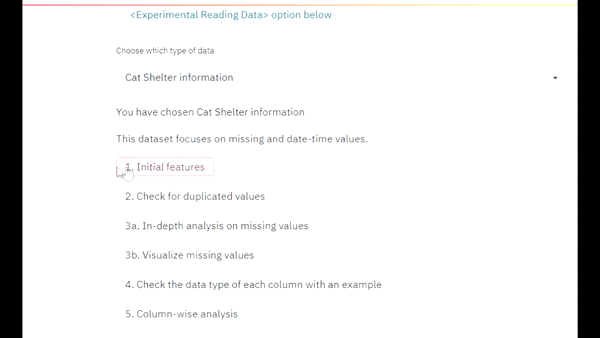
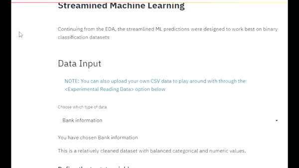

## Introducing AutoEDA&ML:  A Streamlined EDA and ML platform 

The main goal of this project is to build a no-code platform that explains the data behind the model. The 2 main objectives are:
1.	An in-depth expiation of your data through an interactive EDA interface
2.	An ML platform that deploys the best model with interpretable measures

{:height="700px" width="400px"}
{:height="700px" width="400px"}

Let’s look at what each of them can do:

|EDA                          |ML                        
|----------------|-----------------------------
Granular understanding of individual features|Rapid data preprocessing           
|In-depth insights on duplicated values | 11 different supervised classification models to evaluate the best metrics
|Visual analysis on missing values | 10 Folds Cross Validation to find the best hyperparameters
|Uni, bi and multivariate analysis of features         | 15 visual insights to understand the classification       
|Precise breakdown on numeric, categorical and date-time features | Deploy a pipeline of the data preprocessing and model

Here is a visual roadmap of the steps taken: 
